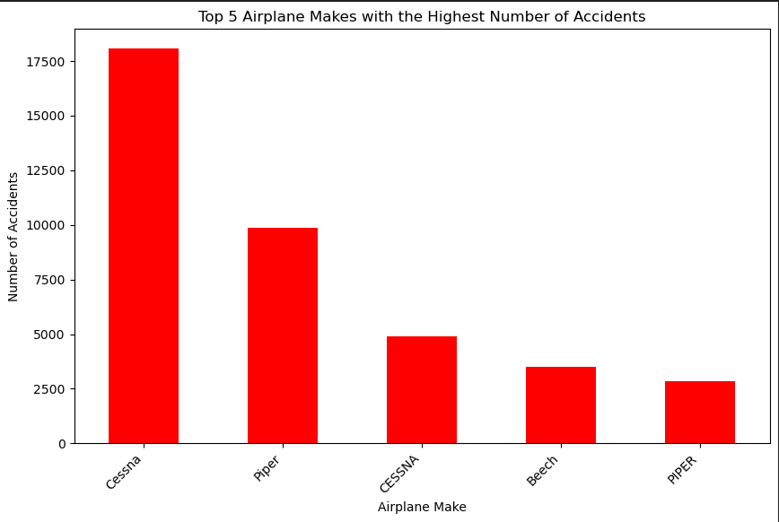
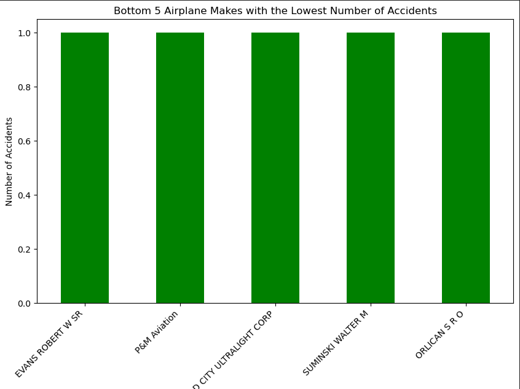
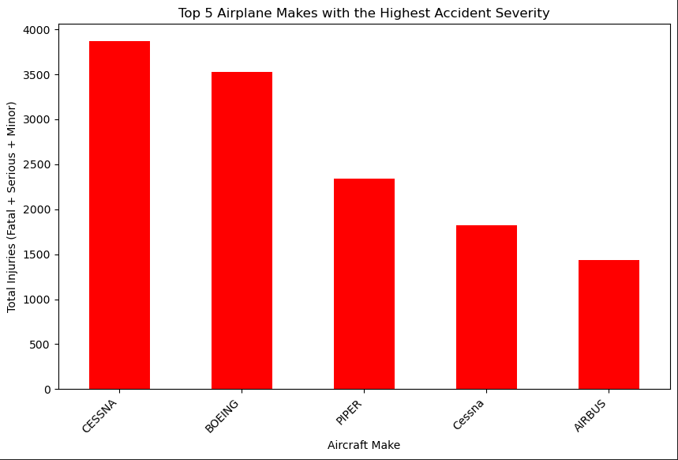
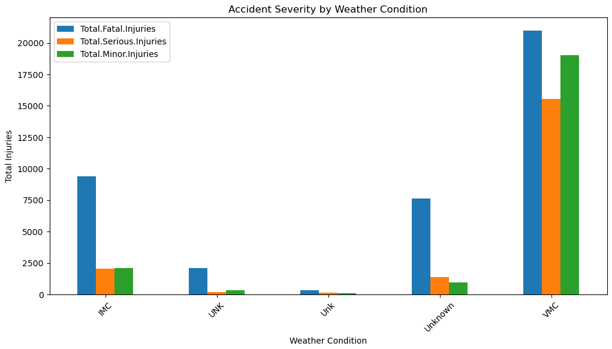
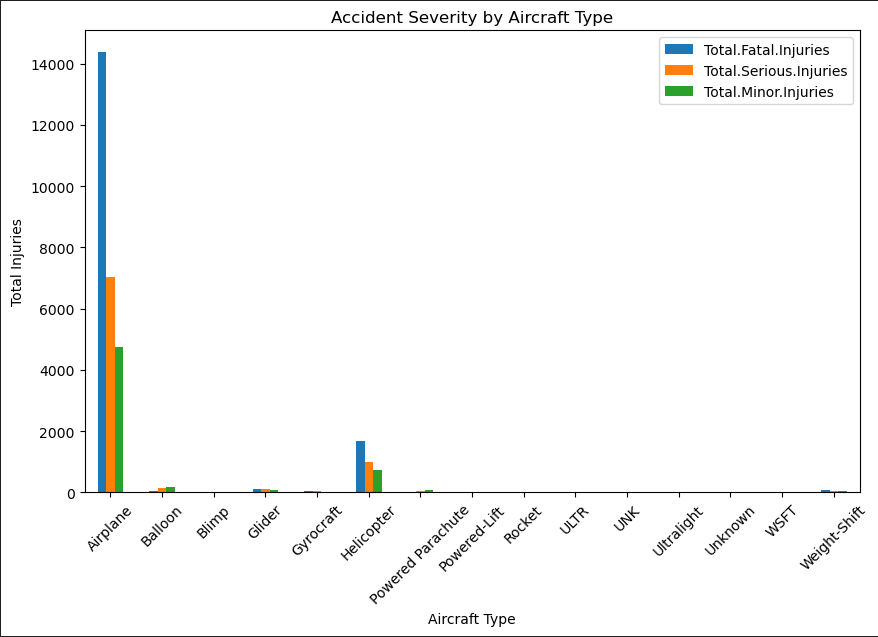
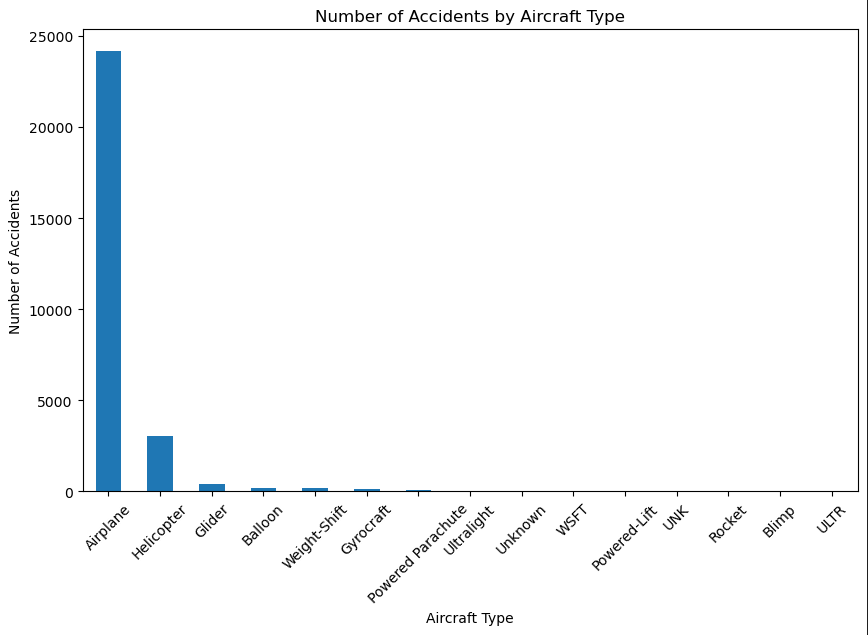

# Aviation Accident Analysis Dashboard

This project provides insights into aviation accident data, helping stakeholders make informed decisions regarding the purchase and operation of airplanes for both **commercial** and **private enterprises**. The dashboard visualizes the analysis of various aircraft makes, their accident severity, frequency, and phases of flight, along with key recommendations for minimizing risks.

## Project Overview

This interactive dashboard is built using **Tableau** to explore aviation accident data from the **National Transportation Safety Board (NTSB)**. The dataset spans decades of aviation incidents and is analyzed to uncover which aircraft makes are involved in the most accidents and which have the highest accident severity.

The analysis includes:
- **Accident Frequency**
- **Accident Severity**
- **Accident Phases and Weather Conditions**
- **Aircraft Make/Model Analysis**

## Visualizations and Key Insights

The dashboard includes several important visualizations, which help in understanding the trends and patterns in the data. Here are some of the key visuals:

### 1. **Interactive Dashboard**
- The primary dashboard (shown below) presents an interactive view where users can filter by **Aircraft Make**, **Accident Severity**, **Flight Phase**, and **Weather Condition**.
- You can view the interactive dashboard by clicking the link below which will redirect you to Github Pages:

[View Interactive Dashboard](https://emmanuel-arch.github.io/dsc-phase-1-project-v3/)

### 2. **Top 5 Airplane Makes with the Highest Number of Accidents**
- This visualization shows which aircraft makes are involved in the highest number of accidents. It helps stakeholders identify the makes that pose higher risks in terms of accident frequency.
- 

### 3. **Bottom 5 Airplane Makes with the Lowest Number of Accidents**
- Here, we highlight the makes with the fewest accidents, providing potential safer options for the company’s fleet.
- 

### 4. **Top 5 Airplane Makes with the Highest Accident Severity**
- This visualization provides insights into the aircraft makes that have the highest severity in accidents, focusing on fatalities and serious injuries. This is crucial for identifying aircraft that may require more stringent safety measures.
- 

### 5. **Accident Severity by Phase of Flight**
- This chart shows the **proportion of fatalities** by flight phase (e.g., Takeoff, Cruise, Approach). It helps in understanding which phases of flight are most dangerous and should be closely monitored.
- 

### 6. **Accident Severity by Weather Condition**
- The weather can have a significant impact on the severity of aviation accidents. This visualization shows how different weather conditions contribute to the severity of accidents.
- 

### 7. **Accident Severity by Aircraft Type**
- This chart shows the severity of accidents for different types of aircraft, helping the company assess which aircraft categories pose higher risks.
- 

### 8. **Number of Accidents by Aircraft Type**
- This visualization displays the frequency of accidents by aircraft type, allowing users to understand which types of aircraft are involved in the most incidents.
- 

## Recommendations Based on Analysis

Based on the insights provided by the dashboard, here are the key recommendations for the company:

### 1. **Airplanes to Avoid (High Risk)**
   - **Cessna**, **Piper**, **Beech**, **Boeing**, and **Airbus** are identified as high-risk due to both high accident frequency and severity. It is recommended to avoid purchasing aircraft from these manufacturers unless enhanced safety protocols and training are implemented.

### 2. **Airplanes to Consider (Low Risk)**
   - Aircraft makes such as **EVANS ROBERT W SR**, **P&M Aviation**, **QUAD CITY ULTRALIGHT CORP**, **SUMINSKI WALTER M**, and **ORLICAN S R O** have a lower frequency of accidents and should be considered for purchase.

### 3. **Consider Helicopters and Gliders**
   - Helicopters and gliders show lower accident frequencies compared to airplanes. The company should consider these aircraft types for certain operations where safety is a priority.

## How to Use This Dashboard

To explore the interactive dashboard:

1. **Interact with Filters**: Use the **dropdown filters** for **Aircraft Make**, **Accident Severity**, **Flight Phase**, and **Weather Condition** to drill down into specific data.
2. **Hover for Details**: Hover over different data points in each visualization to see **detailed numbers** and **additional context**.
3. **Explore Trends Over Time**: Use the **line charts** to see trends over time and identify patterns in accident frequency or severity.
4. **Make Data-Driven Decisions**: Use the insights to identify high-risk aircraft and minimize potential safety hazards in the company’s fleet.

## Next Steps

- Review the dashboard to identify which aircraft should be prioritized for purchase based on accident severity and frequency.
- Implement operational safety measures for high-risk aircraft makes.
- Explore potential for including **helicopters** and **gliders** for certain flight operations to minimize risk.

## About the Data

This analysis is based on the **aviation accident dataset** sourced from the **National Transportation Safety Board (NTSB)**. The dataset includes accident records from 1962 to 2023, covering various types of aircraft involved in incidents in the United States and international waters.

## Contact Information

For more information or further inquiries, feel free to reach out to me:

- [kipletinge123@gmail.com](#)

---

### **Additional Notes**:
- Ensure that all images referenced in the README are stored in the correct path in the `images/` folder.
- The README uses simple language and keeps the information accessible, focusing on the visualizations and recommendations for a business audience.
- Feel free to adjust the **Contact Information** section with your actual details.

---

Let me know if this works for you or if you need any changes or further improvements to the **README.md**!
